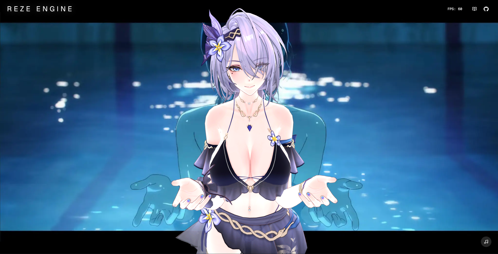

# Reze Engine

A lightweight engine built with WebGPU and TypeScript for real-time 3D anime character MMD model rendering.



## Features

- Physics
- Alpha blending
- Post alpha eye rendering
- Rim lighting
- Bloom
- Outlines
- Toon shading with directional lights
- MSAA 4x anti-aliasing
- GPU-accelerated skinning
- Bone rotation api
- VMD animation

## Usage

```javascript
export default function Scene() {
  const canvasRef = useRef < HTMLCanvasElement > null
  const engineRef = useRef < Engine > null

  const initEngine = useCallback(async () => {
    if (canvasRef.current) {
      try {
        const engine = new Engine(canvasRef.current, {
          ambient: 1.0,
          rimLightIntensity: 0.1,
          bloomIntensity: 0.1,
        })
        engineRef.current = engine
        await engine.init()
        await engine.loadModel("/models/塞尔凯特/塞尔凯特.pmx")

        engine.runRenderLoop(() => {})
      } catch (error) {
        console.error(error)
      }
    }
  }, [])

  useEffect(() => {
    void (async () => {
      initEngine()
    })()

    return () => {
      if (engineRef.current) {
        engineRef.current.dispose()
      }
    }
  }, [initEngine])

  return <canvas ref={canvasRef} className="w-full h-full" />
}
```

## Projects Using This Engine

- **[MiKaPo](https://mikapo.vercel.app)** - Online real-time motion capture for MMD using webcam and MediaPipe
- **[Popo](https://popo.love)** - Fine-tuned LLM that generates MMD poses from natural language descriptions
- **[MPL](https://mmd-mpl.vercel.app)** - Semantic motion programming language for scripting MMD animations with intuitive syntax

## Tutorial

Learn WebGPU from scratch by building an anime character renderer in incremental steps. The tutorial covers the complete rendering pipeline from a simple triangle to fully textured, skeletal-animated characters.

[How to Render an Anime Character with WebGPU](https://reze.one/tutorial)
