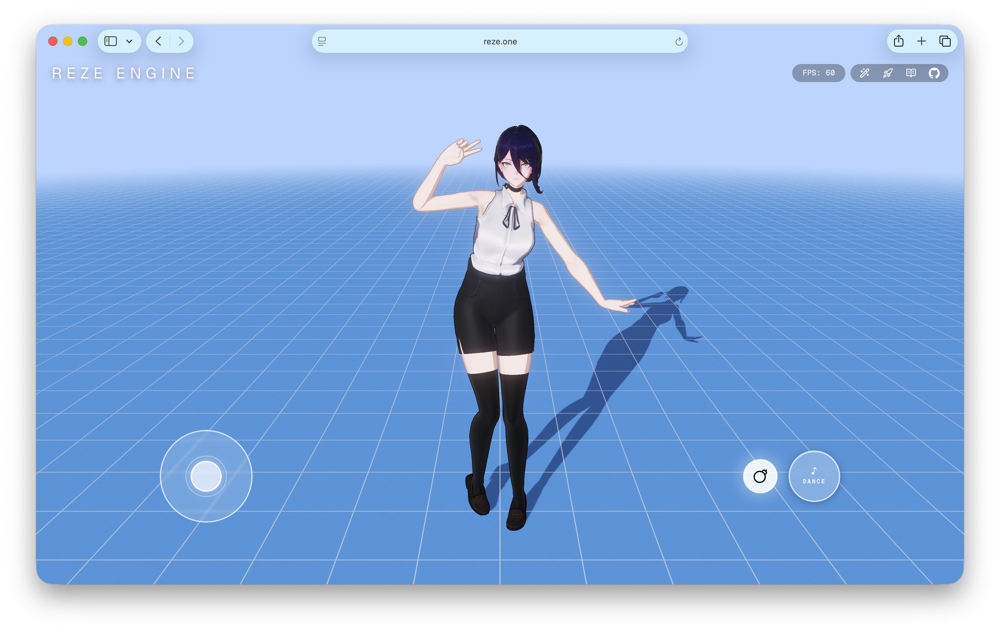

# Reze Engine

[](https://www.npmjs.com/package/reze-engine)

**Zero-runtime-dependency** WebGPU engine for real-time MMD/PMX rendering — renderer, animation, IK, and physics, all in TypeScript.



```bash
npm install reze-engine
```

## Features

- **Anime-style rendering** — toon-ramp NPR over a Principled GGX BSDF, mixed per material
- **Shader-graph materials** — every look is a Blender-style node graph compiled to WGSL; style groups bind any materials to any graph, fully customizable, and PMX sphere maps (`.sph`/`.spa`) are a node, so a model's own highlights are available to any graph that wants them
- **HDR pipeline** — bloom, Filmic tone mapping, ASC CDL colour grading, 4× MSAA, Apple-TBDR-friendly targets
- **Depth of field** — a bladed-bokeh gather in the composite pass, focusing automatically on the character's own depth span. It reads the scene pass's existing depth buffer rather than a G-buffer, and while it is off that buffer is never even stored — the feature costs nothing until you turn it on
- **In-house TS physics** — sequential-impulse rigid bodies for PMX rigs with rest-stable implicit spring-dampers, zero dependencies; structure-of-arrays solver, scene gravity and wind, a world floor so hair and hems rest on the ground instead of clipping through it, and per-frame load shedding that holds framerate on weak devices
- **Math library** — the shared Vec3/Quat/Mat4 layer of the Reze family: euler orders, swing-twist, shortest-arc, look-rotation, zero-alloc `*Into` variants
- **VMD animation** — per-channel bezier curves read the way MMD packs them, IK with per-chain enable read from the motion, morphs on a GPU compute path, and VMD export
- **MMD rig semantics** — 付与親 append inheritance for rotation and movement, composed in MMD's order, and 軸制限 fixed-axis bones, so a 腕捩 twist bone turns along the arm instead of bending it
- **PMX morphs** — vertex, group, bone and material morphs, the last carrying MMD's multiply/add blend so an author's colour and on/off switches work; `getSupportedMorphIndices()` reports what the renderer can actually drive, so a UI never offers a dead control
- **Stage models** — a PMX added as environment rather than cast: no physics, no IK, no outline hulls, and the pose pass skipped while it is idle. Same materials and style groups as any model, and it suppresses the built-in ground plane it would otherwise z-fight with
- **Clip blending & locomotion** — weighted multi-clip pose blending, crossfades, and a game-style character controller (idle/run/sprint speed blend, authored stop skids, code-driven root motion) — the [demo](https://reze.one) is WASD-playable
- **State machine & clip events** — declarative animation states (clips or delegates like the LocomotionController) with guarded crossfade transitions; time-triggered clip callbacks on any playback path
- **Interactive editing** — GPU picking, transform gizmo, bone/material selection
- **Camera** — orbit, bone-follow, or a driven MMD camera VMD; ground + PCF shadows, multi-model scenes
- **Offline rendering** — frame-accurate stepping (`renderFrame`) at any resolution (`setRenderSize`) for video export; background color, 360° equirect backdrop, ground shadow-catcher
- **WGSL scene effects** — a user shader (shadertoy-style) with two mounts, declared by which entry points the code defines: `background` composites between the background and the scene, `foreground` over the finished frame and is handed the scene's depth, so rain and petals are occluded by the character they pass behind and fog thickens with distance. Compile diagnostics and live-tweakable uniform params on both

See [Physics](#physics) and [Rendering](#rendering) for the internals.

## Used by

- [Reze Design](https://reze.design) (web-native scene composer & shader-graph styling)
- [Reze Studio](https://reze.studio) (MMD animation editor)
- [MiKaPo](https://mikapo.reze.one) (motion capture)
- [Reze Rig](https://rig.reze.one) (FBX→VMD retarget)
- [Popo](https://popo.love) (LLM-generated poses)
- [MPL](https://mmd-mpl.vercel.app) (motion language)

## Quick start

```javascript
import { Engine } from "reze-engine";

const engine = new Engine(canvas);
await engine.init();

const model = await engine.loadModel("reze", "/models/reze/reze.pmx");
await engine.autoStyleGroups("reze");

await model.loadVmd("idle", "/animations/idle.vmd");
model.show("idle");
model.play();

engine.addGround();
engine.runRenderLoop();
```

## Codebase map

```
engine/src/
  engine.ts          Engine: device/context, render loop, all passes & pipelines,
                     per-model GPU resources, picking, gizmo   (entry point)
  model.ts           Model: skeleton, 4-bone skinning, morphs (CPU + GPU compute),
                     animation state, drives IK; per-frame update()
  animation.ts       AnimationClip, VMD bezier interpolation, playback/priority
  locomotion.ts      LocomotionController — idle/run/sprint blended over setBlendPose,
                     pivot-gated turns, root motion returned for setModelTransform
  state-machine.ts   AnimationStateMachine — clip/delegate states, guarded crossfade
                     transitions, exit-time returns
  ik-solver.ts       MMD-style CCD IK (angle limits, solve-axis specialization)
  camera.ts          Orbit camera (alpha/beta/radius), bone-follow, mouse/touch
  math.ts            Vec3 / Quat / Mat4 — euler orders, swing-twist, shortest-arc,
                     look-rotation (zero-alloc *Into variants for hot paths)
  pmx-loader.ts      PMX parser: mesh, bones, morphs, rigid bodies, joints
  vmd-loader.ts      VMD motion parser  ·  vmd-writer.ts  VMD export (Shift-JIS)
  asset-reader.ts    URL + local-folder asset resolution  ·  folder-upload.ts
  tga-loader.ts      TGA decoder  ·  dds-loader.ts  DDS/BC1-3  ·  psd-loader.ts  PSD
                     composite — the texture formats createImageBitmap can't read
  index.ts           public exports

  graph/             shader-graph → WGSL compiler — materials as data
    schema.ts          ShaderGraph / StyleGroup / param types + validation
    registry.ts        node registry (Blender node → WGSL) + socket conversions
    compile.ts         validate → prune → toposort → peephole → emit
    render-class.ts    RenderClass / AlphaMode + the RENDER_CLASSES manifest
    slots.ts           per-render-class fs() shell (stencil/alpha) around the graph body
    presets/           the 9 built-in shader graphs (hair, face, eye, cloth, …)

  physics/           in-house rigid-body solver (~4.2k lines)
    physics.ts         RezePhysics: bone↔body sync, fixed-step accumulator + interpolation
    solver.ts          sequential-impulse PGS (joint + contact rows)
    contact.ts         narrowphase (analytical sphere/box/capsule pairs, incl. box-box) + contact pool
    constraint.ts      6DOF spring joints   ·   world.ts  step, gravity + wind
    body.ts            SoA rigid-body store  ·  types.ts

  shaders/
    materials/       nodes.ts (Blender-node WGSL library the graph compiler emits into) +
                     common.ts (bindings, skinning VS, fs() shell)
    passes/          shadow, morph (GPU vertex-morph compute), bloom, composite (Filmic),
                     outline, selection, gizmo, pick, ground, mipmap
```

## API

One WebGPU **Engine** per page (singleton after `init()`). Models load by URL **or** from a user-selected folder ([below](#local-folder-uploads-browser)).

### Engine

```javascript
engine.init()
engine.loadModel(name, path)                 // or ({ files, pmxFile? }) for folder upload
engine.getModel(name) / getModelNames() / removeModel(name)
engine.setModelTransform(name, { position?, rotation?, scale?, visible? }) / getModelTransform(name)  // place, scale or hide a model (scale is uniform)

engine.loadStage(name, { files, pmxFile?, transform? })   // a PMX as ENVIRONMENT, not cast: same geometry and materials (style groups work on it unchanged — that is what makes pure-PMX stages worth supporting), but no physics, no IK, no outline hulls, and the pose pass is skipped while it is idle. A stage is usually the heaviest mesh in the scene and the one that never moves
engine.addStage(model, pmxPath, { name?, transform?, assetReader? })   // the same, from an already-loaded Model
engine.groundIsSuppressed()                  // true while a stage is present — its own floor and addGround's plane both sit at y=0, so the engine refuses to draw the plane rather than z-fight. addGround's settings are kept and come back when the stage is removed

engine.autoStyleGroups(name, overrides?)     // default style groups by material name
engine.applyStyleGroups(name, groups) / upsertStyleGroup / removeStyleGroup / getStyleGroups
engine.setMaterialVisible(name, material, visible) / toggleMaterialVisible / isMaterialVisible

engine.setIKEnabled(enabled)                 // engine-wide OFF for hosts that pose bones themselves; ON hands per-chain state to the clip
engine.setPhysicsEnabled(enabled)
engine.resetPhysics()                        // re-pose bodies from animation + zero velocities (call if physics explodes)
engine.setGravity(vec3) / getGravity()       // scene-wide; default (0, -98, 0) — MMD scale, where a character is ~18 units tall
engine.setWind({ direction, strength, turbulence?, frequency? } | null) / getWind()   // scene-wide air; strength is in gravity's units, so 10-30 reads as a breeze through hair and skirt

engine.setCameraFollow(model, bone?, offset?) / setCameraFollow(null)
engine.setCameraTarget(vec3) / setCameraDistance(d) / setCameraAlpha(a) / setCameraBeta(b)

engine.loadCameraVmd(url) / loadCameraVmdFromBuffer(buffer)   // MMD camera track (dedicated file or a VMD's camera block) drives target/rotation/distance/fov — default-on once loaded
engine.setCameraVmdEnabled(on) / isCameraVmdEnabled() / hasCameraVmd() / clearCameraVmd()   // toggle the shot; while it drives, orbit/pan/zoom is inert — toggle off to hand control back
engine.getCameraVmdDuration()   // seconds the camera track runs for (its last keyframe), 0 with none loaded — its length is its own and need not match any model's clip

engine.setWorld({ color?, strength? }) / setSun({ color?, strength?, direction? })   // runtime lighting
engine.setBackgroundColor(color | null)      // canvas background (display-space sRGB 0–1, composited post-tonemap so it matches a CSS color of the same value exactly); null = transparent canvas (DOM shows through)
engine.setBackdropEquirect(source | null)    // 360° backdrop from an equirect (2:1) image — PhotoDome-style dome at infinity, follows the camera, display-only (no lighting/bloom influence); oversized panoramas auto-downscale to the device texture limit
engine.setEffect(wgsl | null, params?)       // the scene's WGSL effect, mounted by which entry points the code defines — either, or both in one file. fn background(ray: vec3f, uv: vec2f, time: f32) -> vec4f is a LAYER between the base background (color/equirect/transparent) and the scene; fn foreground(ray: vec3f, uv: vec2f, time: f32, depth: f32) -> vec4f composites over the finished frame, which is where rain, snow, petals and fog live. ray = the pixel's world-space view direction (pans with the orbit, same mapping the skybox samples by), uv = 0..1 bottom-left origin, alpha = how much the layer replaces what is behind it. depth (foreground only) = camera-space metres of whatever the scene drew at that pixel, far plane where it drew nothing — compare a particle's own distance against it and the model occludes it; fog reads it directly, since fog's alpha IS a function of distance. Helpers: bgResolution() = canvas size in px, bgCameraPos() = the camera in world space, bgWorldPos(ray, depth) = the world point the scene drew at this pixel — the depth turned into a PLACE, which is what fog lying on the ground needs (it has to know where the ground is) and what keeps a pattern keyed to world position from swimming as the camera orbits. Compiles async off the hot path; on failure the previous effect is KEPT and {ok, diagnostics, mounts} returns line:col errors rebased to the user's code. Declared params ({name: number | {x,y,z}}) become a params.<name> uniform struct shared by both mounts. A foreground makes the scene pass STORE its depth buffer while installed (it is otherwise discarded into tile memory)
engine.setEffectParam(name, value)           // write one declared param — a uniform write, no recompile (live slider tier)
engine.getEffectMounts()                     // { background, foreground } — what the installed effect declared; both false with none set
engine.setColorGrading({ shadows?, midtones?, highlights?, contrast?, saturation? })   // ASC CDL grade on the TONEMAPPED scene: the three tonal colours are display-space sRGB with mid-grey (0.5,0.5,0.5) neutral — direction from neutral is the hue that range is pushed toward, distance is the amount, and going darker/lighter than 0.5 crushes or lifts it (shadows→CDL offset, midtones→power, highlights→slope). contrast pivots on 0.5; saturation is Rec.709. Uniforms-only, no pipeline rebuild — safe to call per frame from a slider. A neutral grade is flagged off and costs nothing per pixel
engine.getColorGrading()                     // current grade, for serialising into a scene descriptor
engine.addGround(options?)                   // options include opacity (0–1): fades the SURFACE while the received shadow persists (shadow catcher — models stay grounded on photo backdrops); shadowStrength 0 disables the shadow
engine.runRenderLoop(callback?) / stopRenderLoop()
engine.renderFrame(deltaSeconds)             // offline rendering: render one frame advancing EVERY clock (animation, physics, camera VMD) by exactly dt — wall-clock independent; call N times with 1/fps for deterministic video export
engine.setRenderSize(w, h) / setRenderSize(null)   // pin render resolution (all targets) independent of the canvas CSS size, e.g. 3840×2160 for export; null returns to CSS-size × devicePixelRatio tracking
engine.getStats()                            // fps + smoothness metrics (frameTimeMax, fps1PercentLow, jitter)
engine.dispose()
```

**Options** — Blender-style scene config: `world` = environment lighting, `sun` = directional lamp (`direction` points from sun into the scene), `camera` = framing (`fov` in radians), `background` = canvas background (display-space sRGB, same semantics as `setBackgroundColor`). Callbacks: `onRaycast`, `onGizmoDrag`. The shadow map is cast from `sun.direction` — the same vector the shader lights with — so shading and cast shadows stay coupled.

### Model

```javascript
await model.loadVmd(name, url) / model.loadClip(name, clip)
model.show(name)
model.play(name, { priority?, loop? })       // priority: higher wins when clips compete (0 = default)
model.pause() / stop() / seek(time)
model.clearAnimation()                       // stop + DEACTIVATE the clip (stop() keeps it current for re-play; clear() forgets it, so resetAllBones/Morphs actually shows the bind pose)
model.getAnimationProgress()                 // { current, duration (s), playing, paused, looping, … }
model.exportVmd(name)                        // → ArrayBuffer (Shift-JIS bone/morph names)

model.rotateBones({ 首: quat }, ms?) / moveBones({ センター: vec3 }, ms?)
model.setMorphWeight(name, weight, ms?)      // drives vertex, group, bone and material morphs alike
model.getMorphing()                          // { morphs: [{ name, type, … }] } — PMX type: 0 group, 1 vertex, 2 bone, 3–7 UV, 8 material, 9 flip, 10 impulse
model.getSupportedMorphIndices()             // indices this renderer can actually move: vertex, bone, material, and group morphs resolving to one of those. UV morphs are parsed but not yet applied; flip and impulse are PMX 2.1 and unsupported. Filter a morph UI by this so it never shows a control that does nothing
model.resetAllBones() / resetAllMorphs()
model.getBoneWorldPosition(name)

model.setBlendPose(entries)                  // pose from N weighted clips {name, time, weight} — the caller owns every clock; rest pose fills a weight sum below 1
model.crossfadeTo(name, seconds, { loop? })  // fade the current clip (or the rest pose) into a target that owns the progress clock
model.setBoneRotationOffset(name, quat)      // constant local offset composed after every pose source (the classic heel correction); null clears
```

### Locomotion

```javascript
const walk = new LocomotionController(model, { idle, run, sprint }, { runSpeed, sprintSpeed })
walk.setMove(x, y, sprint?)                  // world-vector input: turns toward it (pivots in place past 45°), then runs
walk.setDrive(forward, steer, sprint?)       // tank-style alternative: steer rotates the facing, forward runs along it
const pose = walk.update(dt)                 // per frame: blends the pose, integrates root motion
engine.setModelTransform(name, { position: pose.position, rotation: pose.rotation })
```

Clips are in-place; run and sprint share one gait phase so blends stay on the same feet. Match `runSpeed`/`sprintSpeed` to the clips' authored root motion or the feet slide.

`AnimationClip` holds keyframes only (bone/morph tracks keyed by `frame`, plus `frameCount`); time advances at fixed `FPS` (exported, default 30).

### State machine & clip events

```javascript
const loco = new LocomotionController(model, clips, { autoApply: false }) // computes but does not apply
const sm = new AnimationStateMachine(model, {
  loco:  { entries: (dt) => { loco.update(dt); return loco.getBlendEntries() } },
  skill: { clip: "Skill_A", loop: false },
}, [
  { from: "loco",  to: "skill", when: () => wantSkill },
  { from: "skill", to: "loco" },                 // unconditional: fires as the clip ends
], { initial: "loco" })
sm.update(dt)                                    // per frame; crossfades keep the outgoing state advancing

model.addClipEvent("Skill_A", 0.42, (e) => sfx()) // fires when playback crosses 0.42s on any path; returns unsubscribe
```

### Math

Every operation has an allocating form and a zero-alloc `*Into` form (out parameter last, returned).

```javascript
Quat.fromEulerOrder(x, y, z, order)   // intrinsic order string "YXZ" | "ZYX" | … ; toEulerOrder(q, order) inverts
Quat.fromUnitVectors(from, to)        // shortest arc
Quat.twistAroundAxis(q, axis)         // swing-twist split: q = swing · twist
Quat.lookRotation(forward, up)        // +Z forward
Quat.rotateVec(q, v) / rotateVecInv(q, v)
Quat.fromBasis(x, y, z)               // rotation taking the standard basis onto x/y/z
Quat.slerp(a, b, t) / nlerp / dot / angleTo / mirrorZ   // mirrorZ = RH ↔ LH (with Vec3.mirrorZ)
bezierInterpolate(x1, x2, y1, y2, t) / interpolateControlPoints(cp, t)   // VMD 127-space curves
```

### Local folder uploads (browser)

Feed a `<input type="file" webkitdirectory>` `FileList` (or drag/drop) into the engine; textures resolve relative to the chosen PMX inside that tree.

> **Gotcha:** copy `input.files` into an array **before** `input.value = ""` — the `FileList` is live and clearing the input empties it.

`parsePmxFolderInput(fileList)` returns a tagged result; for `single` you get `{ files, pmxFile }` directly, for `multiple` show a picker over `pmxRelativePaths` and resolve with `pmxFileAtRelativePath(files, path)`. Then:

```javascript
const picked = parsePmxFolderInput(e.target.files);
e.target.value = "";
if (picked.status === "single")
  await engine.loadModel("m", { files: picked.files, pmxFile: picked.pmxFile });
```

VMD and other assets still load by URL when the path starts with `/` or `http(s):`; relative paths resolve against the PMX directory.

**Any `File[]` works, not just folder picks** — files from plain multi-select or drag & drop carry `webkitRelativePath === ""` and key by **filename** instead (which may itself contain a path: hosts that extract a model `.zip` in-app can synthesize `new File(data, "model/tex/body.png")` and paths resolve exactly like a folder pick). Texture paths additionally fall back to **basename matching** — a PMX referencing `tex/body.png` finds a flat `body.png`; the same fallback rescues wrongly-cased directory names.

### Texture formats

PNG, JPEG, WebP and the rest of what the browser decodes, plus three it doesn't:

| | |
| --- | --- |
| **TGA** | true-colour (16/24/32), grayscale and colour-mapped, raw or RLE — common in PMX packs, especially sphere maps |
| **DDS** | BC1/BC2/BC3 (DXT1/3/5) and uncompressed BGRA/RGBA/24-bit, including `DX10` headers — what a stage converted out of a game usually carries |
| **PSD** | the flattened composite of a PSD or PSB: RGB, grayscale, indexed and duotone, 8 or 16-bit, raw or RLE — texture packs are often shipped as the artist's working files |

DDS and PSD are recognised by their **magic bytes rather than their extension**, because in these packs the extension is frequently wrong — a `.tga` that is really a DDS, a `.png` that never stopped being a Photoshop file. All three decode on the CPU to RGBA8, so DDS needs no `texture-compression-bc` device feature and works where that is unavailable.

A texture that cannot be decoded is logged and skipped, and its material falls back to white — a model never fails to load over one bad file. Two known limits: a PSD saved with *Maximize Compatibility* off carries no usable composite, and CMYK/Lab PSDs are refused rather than converted without a profile.

### Interactive pose editing

Double-click picks a bone or material (per-triangle dominant-joint from the GPU pick, so one handler serves both modes); a local-axis transform gizmo drags it. **The engine only reports — it never writes the skeleton itself**, so the host chooses the write policy.

```typescript
engine.setSelectedBone(modelName | null, boneName | null)       // shows the gizmo
engine.setSelectedMaterial(modelName | null, materialName | null) // selection outline

onRaycast: (modelName, material, bone, screenX, screenY) => { ... } // modelName "" = missed

type GizmoDragEvent = {
  boneName: string; boneIndex: number; kind: "rotate" | "translate"
  localRotation: Quat; localTranslation: Vec3   // target absolute local transform
  phase?: "start" | "end"                       // undefined during drag moves
}
```

The gizmo consumes mouse input inside its bounding sphere so drags never fight camera orbit. Apply the reported transform — runtime override (below) or keyframe edit into a clip you re-`loadClip`:

```javascript
onGizmoDrag: (e) => {
  const model = engine.getModel(e.modelName);
  if (!model) return;
  if (e.phase === "start") {
    model.pause();
    model.setClipApplySuspended(true);
    return;
  } // stop re-sampling wiping the edit
  if (e.phase === "end") return;
  if (e.kind === "rotate")
    model.rotateBones({ [e.boneName]: e.localRotation }, 0); // 0 = instant write
  else model.setBoneLocalTranslation(e.boneIndex, e.localTranslation);
};
// play()/seek() auto-clear the suspend flag (edit is lost — runtime-override semantic).
```

Note the asymmetry: rotation goes through `rotateBones(…, 0)`, but translation uses `setBoneLocalTranslation(idx, v)` — `moveBones` converts VMD-relative→local, and the gizmo output is already local.

## Shader graphs & style groups

Materials are styled by **shader graphs** — plain JSON (`ShaderGraph`) validated and compiled to WGSL at runtime. Node semantics track **Blender 5.2**: Principled carries its v2 sockets, and the math (39), vector-math (24) and mix (20) operation sets are Blender's own, transcribed from its GLSL with the safeguards intact (divide-by-zero is 0, modulo truncates), so community Blender NPR presets port by transcription. Sockets match Blender's too — every math node carries three value inputs whichever operation is selected, so a transcription maps socket for socket. One node has no Blender counterpart because MMD has no equivalent to borrow: **`sphere_map`** applies the PMX material's own sphere texture, which is where a PMX keeps its highlights — every model ships one, and hair without it reads flat. The texture is a view-space lighting mask sampled by the camera-space normal rather than by any UV the mesh carries, which is why it tracks the viewer. The material's own mode picks the operator (`.sph` multiplies the shaded base, `.spa` adds), so a graph asks for the effect and the model decides which it meant; a material with no sphere texture is an exact no-op. Three nodes have no Blender counterpart in the same sense, because they answer questions a `.blend` answers with scene objects: **`light`** exposes the key light as values (direction, colour, ambient, shadow), which is what a graph needs to build its own `dot(N, L)` term rather than accept a baked closure — the idiom most game NPR presets use, where the original reads a light empty through a driver. **`head_basis`** gives the head bone's forward/right/up, for face shading that tracks the head. **`tex_image/0`…`3`** read up to four image maps carried by the style group.

Nine graphs ship built-in (`FACE_GRAPH`, `HAIR_GRAPH`, `BODY_GRAPH`, `EYE_GRAPH`, `METAL_GRAPH`, `STOCKINGS_GRAPH`, `CLOTH_SMOOTH_GRAPH`, `CLOTH_ROUGH_GRAPH`, `DEFAULT_GRAPH` — the neutral base) as a starter library; you can also author or import your own.

A **style group** binds `{ materials, graph, renderClass?, alphaMode? }` — a set of materials, the graph that shades them, and the engine's small pass-integration vocabulary (`renderClass`: `auto`/`eye`/`hair` for stencil/cull/draw-order; `alphaMode`: `opaque`/`hashed`). **Groups are user-defined and unlimited** — any materials, any graph. A graph is pure shading; `renderClass` carries the built-in effects (hair's over-eyes stencil, the eye see-through stamp), so any graph in an `eye`/`hair` group inherits them. **Every group needs a valid graph**; a material in no group renders the **neutral default** (`DEFAULT_GRAPH`).

Two ways to make groups:

```javascript
import { HAIR_GRAPH, compileGraph } from "reze-engine";

// 1. autoStyleGroups — one default group per matched category (its shipped graph). Easy path.
await engine.autoStyleGroups("reze");

// 2. applyStyleGroups — arbitrary groups: any id, any materials, any graph.
await engine.applyStyleGroups("reze", [
  {
    id: "hair",
    materials: ["髪", "前髪"],
    graph: HAIR_GRAPH,
    renderClass: "hair",
  },
  { id: "visor", materials: ["visor", "hud"], graph: myCustomGraph }, // your own graph
]);
engine.setStyleParam("reze", "hair", "rim", 0.8); // exposed param → instant uniform write
engine.removeStyleGroup("reze", "hair"); // its materials drop to the neutral default

// Headless (no GPU needed):
const { ok, wgsl, diagnostics } = compileGraph(HAIR_GRAPH, {
  renderClass: "hair",
});
```

**How `autoStyleGroups(model, overrides?)` resolves** — it assigns each material a _style category_, then buckets materials by category into one group each:

1. **`overrides` first** — an explicit `{ category: [materialNames] }` map (the arg). Use it for the names the built-in hints can't read.
2. **Then built-in name hints** — a case-insensitive **substring** match of the material name against per-category JP/CN/EN keyword lists, ordered **most-specific-first** so families don't collide (`靴下`/`stocking` resolves to `stockings` before `靴`/`shoes` would hit `cloth_smooth`). This covers standard-named models with no overrides at all.
3. **No match → ungrouped** — the material renders the neutral default. "Unmatched" is a real, intended outcome, not a catch-all bucket.

The **built-in name hints**, checked top-to-bottom (first match wins), with the graph and pass-integration each category carries:

| Category       | Graph · render-class / alpha       | Matches a name containing (case-insensitive substring)                                                                                                                                               |
| -------------- | ---------------------------------- | ---------------------------------------------------------------------------------------------------------------------------------------------------------------------------------------------------- |
| `stockings`    | `STOCKINGS_GRAPH` · `hashed` alpha | 靴下 · ソックス · タイツ · ニーソ · 袜 · stocking · socks · tights                                                                                                                                   |
| `eye`          | `EYE_GRAPH` · `eye`                | 白目 · 目影 · 二重 · 睫 · まつげ · まゆ · 眉 · 目 · 瞳 · 眼 · eye · iris · pupil · lash · brow                                                                                                       |
| `face`         | `FACE_GRAPH`                       | 顔 · 颜 · 脸 · かお · face · 舌 · tongue · 牙 · 牙齿 · 歯 · teeth · tooth · 口腔 · 口内 · mouth · 嘴 · 歯茎 · gums                                                                                   |
| `hair`         | `HAIR_GRAPH` · `hair`              | 前髪 · 後髪 · 髪 · 髮 · 头发 · 頭髪 · もみあげ · アホ毛 · ヘア · hair · ahoge · bang                                                                                                                 |
| `body`         | `BODY_GRAPH`                       | 肌 · 皮肤 · skin                                                                                                                                                                                     |
| `metal`        | `METAL_GRAPH`                      | 金属 · メタル · metal · earring · 耳环 · 耳環                                                                                                                                                        |
| `cloth_smooth` | `CLOTH_SMOOTH_GRAPH`               | 服 · 衣 · 裙 · 裤 · スカート · ワンピ · リボン · 袖 · 靴 · 鞋 · 帽 · 体 · 飾 · 饰 · 尾 · 套 · 腿 · skirt · dress · ribbon · sleeve · shoes · shirt · short · boot · hat · cloth · accessor · trigger |

`cloth_rough` and `default` have **no** name hints — a material reaches them only via an explicit `overrides` entry. The group `id` is the category name, so re-running `autoStyleGroups` is idempotent; its promise resolves after every graph compiles, so `getStyleGroups(model)` is ready the moment it resolves — seed your own store from it, then edit with `applyStyleGroups`.

Validation catches material conflicts, type mismatches, cycles, and bad links with node-level diagnostics; a failed compile keeps the previous pipeline rendering (fallback-on-error).

## Physics

In-house sequential-impulse rigid-body solver for PMX rigs (sphere / box / capsule colliders, 6DOF spring joints), ~4.2k lines of TypeScript, no external dependency, at quality comparable to Bullet's defaults. A fixed-timestep accumulator runs at a constant **60 Hz** (≤6 substeps/frame) so spring impulse, damping, and integration stay deterministic; dynamic bodies are **render-interpolated** between substeps to stay smooth when the display rate ≠ 60 Hz.

**Per substep:** `predict velocities → broad + narrowphase → solve constraints (10 iters) → split-impulse position correction → integrate`.

- **Solver** — projected Gauss-Seidel, joint rows + contact rows in one loop. Joints are 6DOF spring constraints (3 linear + 3 angular) with stop-ERP limit correction. Linear rows pivot on each body's own joint-frame origin (Spring2-style, not Bullet 2.7x's shared mid-anchor), so a violated joint pulls itself back together instead of degenerating into torque and "breaking".
- **Implicit spring-dampers** — each sprung axis solves the backward-Euler soft constraint `relVel⁺ + (k/γ)·err + s·λ = 0` (`γ = c + h·k`, `s = 1/(h·γ)`), unconditionally stable for any authored stiffness, with damping `c = 2ζ√(k·m_eff)` intrinsic to the row. Resting cloth genuinely settles: the previous clamped velocity-drive could inject energy far from equilibrium but not absorb it near it, so static dresses slowly "boiled" — measured 15× lower resting velocity after the change, with authored stiffness now delivered in full (no deadbeat clamp).
- **Angular limits** — hybrid: small violations (< 0.5 rad, the resting-cloth regime) use per-axis Euler stop rows, which converge cleanly and keep resting cloth still; larger violations switch to a single geodesic row toward the Euler-clamped target rotation, because per-axis Euler rows chase phantom errors near the ±90° singularity and pump energy. Ranged stops are unilateral (accumulated impulse clamped to the corrective sign) so a limit pushes back into range but never brakes natural recovery; locked axes stay bilateral equality joints. Spring rows stay per-axis, with stiffness clamped to the `k·dt² ≤ ¼` stability bound.
- **Narrowphase** — analytical sphere-sphere / -capsule / -box, capsule-capsule / -box, and box-box (SAT + face clipping, up to 4 points per manifold). MMD dress rigs are built from box panels, and box-box is the majority of collidable pairs on those models — without it cloth passes through cloth. Capsule-capsule emits multiple contacts along near-parallel axes so cloth can't pivot around a single closest point.
- **Penetration and separation are one term**, ported from Bullet 2.75 (`m_erp` 0.2), the build MMD's own physics runs: the contact row's target carries `depth · erp / dt`. Penetrating, it pushes apart; separated — a speculative row inside the `0.04` margin — it *allows* the approach that closes the gap, which is what keeps those rows inert until the body would really arrive. A push-only clamp does not achieve that on its own: it forbids a pulling impulse, not a large pushing one on a body still in mid-air.
- **Warm starting** (`0.85`) over persistent per-pair manifolds, up to 4 points matched in each body's own local frame, so a resting stack starts each substep already holding roughly the load it needs. When a 5th point arrives the one dropped is whichever leaves the largest quadrilateral — area is what stops a resting box pivoting.
- **Contact ordering is reshuffled between iterations.** Projected Gauss-Seidel is order-biased, rows solved first win, and on a cross-linked skirt lattice that reads as chatter. The shuffle is re-seeded per substep, so a scene still replays identically.
- **Split impulse** resolves deep overlap on a pseudo-velocity channel with its own full iteration pass, integrated straight into the transform. Recovering penetration therefore adds no real momentum for the joint springs to hand back — the property MMD depends on, given how constantly its hair and layered skirts clip.
- **Kinematic advancement** — bone-driven bodies move toward the frame's bone pose incrementally per substep, with velocities derived over the fixed step, so the solver never sees more than one 60 Hz step of anchor motion regardless of render dt.
- **Discontinuity guards** — a bone-pose jump beyond continuous motion (timeline scrub, long stall) rigidly carries each dynamic body along with its kinematic root's transform delta and zeroes momentum instead of dragging cloth across the gap; correction velocities are clamped (120 u/s linear, 30 rad/s angular), per-step travel is capped, and any body that still goes non-finite is restored to its previous substep pose.
- Sleeping is off (cloth must always react); resting bodies bleed micro-velocity via per-PMX damping.

- **Gravity and wind** are scene-wide and summed once per substep, so wind costs the per-body loop nothing. Wind is an acceleration rather than a drag model: PMX authors already tune per-body damping to get the hang they want, and a second hidden drag term would fight it. Gusting rides a pair of incommensurate sines — one alone is a metronome — and advances on *simulated* time, so an exported take gusts frame-for-frame as its preview did.

Engine surface is `setPhysicsEnabled` / `resetPhysics` / `setGravity` / `setWind` — everything else (mass, damping, friction, restitution, joint stiffness/limits, collision groups) lives on the PMX rig.

## Rendering

Each built-in shader graph mixes an NPR stack with a Principled-style BSDF, so characters keep a flat illustrated look while highlights and reflections stay grounded. A graph compiles to a fragment shader following one 7-stage layout (node primitives from `nodes.ts`, the fs() shell from `common.ts`):

```
(A) setup → (B) texture + alpha → (C) NPR stack → (D) optional bump
→ (E) Principled BSDF → (F) NPR↔PBR mix → (G) FSOut
```

`default` uses only A/B/E/G; the NPR graphs add C (and sometimes D), with F choosing how NPR-leaning the result is.

- **PBR core** (`eval_principled`) — GGX + Schlick Fresnel, Walter–Smith G1, Fdez-Agüera 2019 multi-scatter, Karis split-sum DFG LUT, Heitz 2016 LTC direct-spec, optional sheen.
- **NPR toolbox** — toon ramps (constant / fwidth-AA'd), HSV warm-shadow / cool-light remaps, fresnel + layer-weight rims, value-noise bump, Voronoi metallic sparkle, BT.601-gated emission.

| Built-in graph | Notes                                                                   |
| -------------- | ----------------------------------------------------------------------- |
| `default`      | Plain Principled, metallic 0, rough 0.5                                 |
| `eye`          | Plain + post-eval emission ×1.5                                         |
| `face`         | Toon + warm rim + dual-fresnel rim + bright-tex gate, noise bump        |
| `body`         | Toon + warm rim + fresnel + facing rim, noise bump                      |
| `hair`         | Toon + fresnel + bevel + bright-tex gate, 20% PBR                       |
| `cloth_smooth` | Toon + bevel + emission overlay (×18)                                   |
| `cloth_rough`  | Same NPR, live noise bump, rough 0.82                                   |
| `metal`        | Toon + emission overlay (×8), Voronoi base, metallic 1                  |
| `stockings`    | Gradient × facing mask + HSV emission (×5), sheen 0.7, **alpha-hashed** |

**Post & output.** Directional shadow map (4096², depth32float, PCF) → HDR main pass at 4× MSAA (`rg11b10ufloat` color + `rg8unorm` aux MRT for bloom mask + alpha; fits Apple-Silicon TBDR tile memory so MSAA resolves in-tile, `rgba16float` fallback) → bloom mip pyramid → view transform (`setViewTransformOptions`: `standard` — sRGB and nothing else, which is what NPR and anime work renders under; `filmic` — Blender 3.6 "Filmic / Medium High Contrast" as a LUT, the default; `agx` — Blender's own 57³ `AgX_Base_sRGB.cube`, plus exposure and gamma) → ASC CDL colour grade (`setColorGrading`, scene only — the background layer and any green-screen key are deliberately left ungraded) → composite over the background (base color / 360 equirect, then the optional user WGSL effect layer over-composited by its alpha, display space) → inverted-hull outline.

- **Alpha-hashed transparency** (`stockings`) — Wyman & McGuire 2017 derivative-aware stochastic discard in object space, so self-overlapping meshes resolve under MSAA with opaque depth writes and the dither doesn't swim.
- **Sheer-material detection** — PMX has no "translucent" flag (a see-through veil usually ships diffuse alpha 1.0 with the transparency in its texture), so at load each material samples its texture's alpha at its own triangle centroids; genuinely sheer materials route to the transparent bucket — drawn after the opaque + hair passes so a veil composites over the hair behind it, and excluded from the shadow map so sheer cloth doesn't cast the solid shadow of an opaque sheet. Centroids, not vertices: hair-card corners sit in transparent texture margins, and hair must stay opaque-bucket for stencil interplay and shadows.
- **See-through hair over eyes** — stencil-gated extra pass: the eye stamps `EYE_VALUE`, main hair skips it, an extra pass matches it and blends hair at 25% in linear HDR so eyes stay readable.

## Tutorial

[How to Render an Anime Character with WebGPU](https://reze.one/tutorial)
