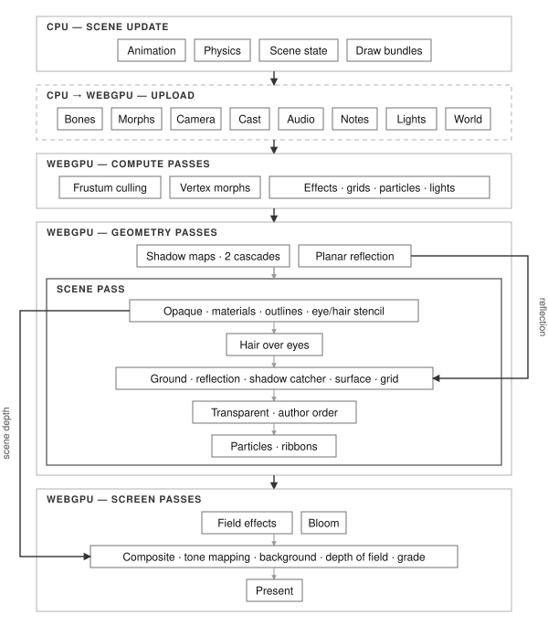

# Reze Engine

[](https://www.npmjs.com/package/reze-engine)

**Zero-runtime-dependency** WebGPU engine for real-time MMD/PMX rendering — renderer, animation, IK, physics, and a multi-effect VFX system, all in TypeScript.

One piece of the **Reze MMD family**, covering the whole MMD workflow on the web:

|                                                         |                                                                                |
| ------------------------------------------------------- | ------------------------------------------------------------------------------ |
| **reze-engine**                                         | This repo — the WebGPU foundation, anime-character rendering and physics        |
| [reze-design](https://github.com/AmyangXYZ/reze-design) | Scene design, rendering and sharing                                             |
| [reze-studio](https://github.com/AmyangXYZ/reze-studio) | Animation editing on a professional timeline and curve editor                   |
| [MiKaPo](https://github.com/AmyangXYZ/MiKaPo)           | Real-time motion capture in the browser, exporting straight to VMD              |
| [reze-rig](https://github.com/AmyangXYZ/reze-rig)       | Retarget FBX animations to MMD VMD format, Mixamo and Unity tested              |


```bash
npm install reze-engine
```

## Features

**MMD fidelity**

- PMX models and stages, VMD motion with MMD's own bezier packing, IK with per-chain enable, append-inherit bones and fixed-axis twist bones, VMD export
- Vertex / group / bone / material morphs (multiply and add), vertex morphs on a GPU compute path
- MMD draw disciplines reproduced: author-order transparency with depth write, per-mesh interleaved outline hulls, the eyes-through-bangs stencil pass, sphere maps as graph nodes
- In-house sequential-impulse physics for PMX rigs — rigid bodies, joints, deterministic wind, a world floor

**Rendering**

- Shader-graph materials: every look is a Blender-style node graph compiled to WGSL; style groups bind any materials to any graph; ungrouped materials render a Principled BSDF default
- HDR pipeline end to end — bloom, 4× MSAA, three view transforms (Filmic, Standard, AgX from Blender's own LUT), ASC CDL grading, bladed-bokeh depth of field
- Two concentric shadow cascades: crisp contact shadows on the cast, coverage for a full stage
- Floor mirror: a planar reflection pass reusing the scene pipelines, with depth-proportional blur and the reflection composited as its own ground layer
- HDRI worlds (`.hdr`): the sky renders through the same view transform as the scene and lights the cast via spherical-harmonic irradiance — the sun keeps the toon ramp
- Positional lights, placed in the scene or emitted by effect shaders — stage rigs, firework bursts, a hand ribbon lighting the dancer as it passes

**Effects**

- N simultaneous scene effects, each one WGSL file declaring its mounts: fullscreen background/foreground, GPU particles, bone-trail ribbons, a persistent simulation grid, and lights
- Effects read the scene through data interfaces — the cast (bones, velocities, trail history), the audio analysis, MIDI notes, `.lrc` lyrics with their words rasterised for the shader to draw, and per-pixel object/material ids
- Particles and ribbons are scene geometry: depth-tested, bloomed, and reflected in the mirror
- Install-time compile diagnostics per effect; a broken effect fails alone

**Pipeline**

- GPU frustum culling writing indirect draw arguments, replayed through render bundles — the CPU re-encodes only when scene structure changes
- Deterministic by construction: everything runs on the scene clock, so offline export (`renderFrame` at any resolution) reproduces the live scene exactly
- Camera: orbit, bone-follow, or a driven MMD camera VMD; GPU picking, gizmos, morph/material editing surfaces
- Every emitted shader is compiled on a real GPU device by the repo's validation tool (`engine/tools/validate-wgsl.mjs`) before release

## Architecture

One frame, top to bottom. The CPU describes the scene once and the GPU runs it: culling and effect simulation in compute, shadows and the floor mirror feeding a scene pass that draws MMD the way MMD artists expect — author order, outlines, the eye/hair stencil — then bloom, film tone mapping, and depth of field finish the image.



## License

MIT
